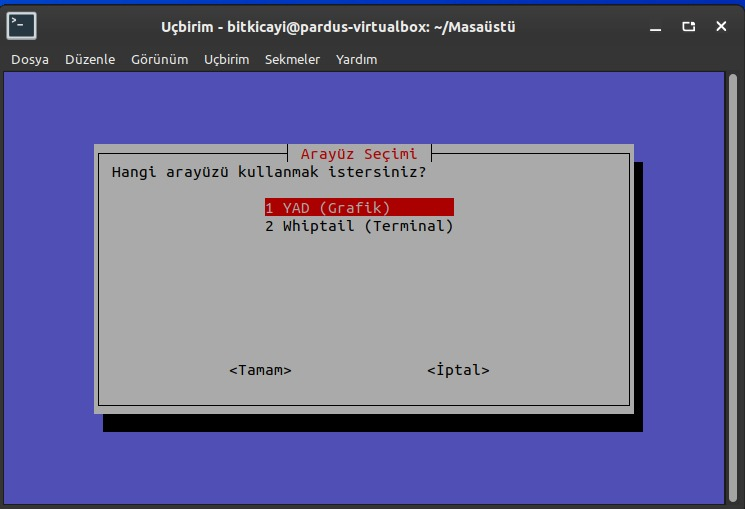
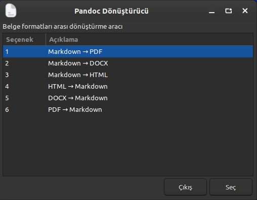
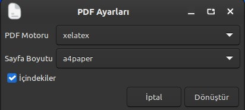

# Pandoc Converter

Pardus için geliştirilmiş modern ve kullanıcı dostu belge format dönüştürme aracı.

## Özellikler

- **6 Farklı Dönüştürme Seçeneği**
  - Markdown → PDF/DOCX/HTML
  - HTML → Markdown
  - DOCX → Markdown
  - PDF → Markdown

- **Çift Arayüz Desteği**
  - YAD (Grafik GTK+ arayüzü)
  - Whiptail (Terminal tabanlı)

- **Gelişmiş PDF Ayarları**
  - 3 farklı PDF motoru (pdflatex, xelatex, lualatex)
  - Sayfa boyutu seçimi (A4, Letter)
  - İçindekiler tablosu desteği

- **Hata Yönetimi**
  - Detaylı hata mesajları
  - Eksik paket kontrolü
  - Kullanıcı dostu uyarılar

## Ekran Görüntüleri

### Arayüz Seçimi


### YAD Ana Menü


### Whiptail Ana Menü


### PDF Dönüştürme Ayarları


## Kurulum

### Gerekli Paketlerin Yüklenmesi

**Pardus için tek komut:**
```bash
sudo apt update && sudo apt install -y pandoc yad whiptail poppler-utils texlive-xetex texlive-lang-european texlive-fonts-recommended
```

### Projeyi İndirme

```bash
git clone https://github.com/bitkicayi/pandoc-converter.git
cd pandoc-converter
chmod +x pandoc-converter.sh
```

## Kullanım

Programı başlatmak için:

```bash
./pandoc-converter.sh
```

veya sistem genelinde kullanmak için:

```bash
sudo cp pandoc-converter.sh /usr/local/bin/pandoc-converter
pandoc-converter
```
## Demo Videosu

Projenin kullanımını ve dönüştürme süreçlerini aşağıdaki videodan izleyebilirsiniz:

[](https://www.youtube.com/watch?v=Eb00X8K4LDQ)

## Dönüştürme Seçenekleri

| Kaynak Format | Hedef Format | Özellikler |
|---------------|--------------|------------|
| Markdown | PDF | PDF motoru, sayfa boyutu, TOC |
| Markdown | DOCX | Standart Word formatı |
| Markdown | HTML | Standalone, CSS, syntax highlighting |
| HTML | Markdown | Temel dönüştürme |
| DOCX | Markdown | Görsel çıkarma desteği |
| PDF | Markdown | Text extraction (pdftotext) |

## Teknik Detaylar

- **Platform:** Pardus
- **Dil:** Bash Script
- **UI Kütüphaneleri:** YAD, Whiptail
- **Dönüştürme Motoru:** Pandoc 2.0+
- **PDF İşleme:** TeXLive, poppler-utils

### Teknik Notlar: XeLaTeX Desteği
Türkçe karakterlerin (ş, ğ, ü, ö, ç, ı, İ) PDF çıktılarında sorunsuz görüntülenmesi için PDF motoru olarak **XeLaTeX** seçilmesi önerilir. Bu araç, Pardus sistem fontlarını kullanarak UTF-8 uyumlu çıktılar üretir.

## Geliştirici Notları

Bu proje Pardus için Linux Araçları ve Kabuk Programlama dersi kapsamında geliştirilmiştir. Proje içerisinde kullanılan temel kavramlar:

- Bash scripting ve fonksiyonlar
- Koşullu ifadeler (if-else, case)
- GUI-TUI (YAD, Whiptail)
- Dosya ve dizin işlemleri
- Hata yakalama ve yönetimi
- Kullanıcı arayüzü tasarımı

## 🇹🇷 Pardus Uyumluluğu

Bu araç özellikle Pardus işletim sistemi için optimize edilmiştir ve Pardus 23.x sürümüyle tam uyumludur. Pardus'un varsayılan paket depolarından tüm bağımlılıklar kolayca kurulabilir.

## Geliştirici

**Burak Ege Yaşar**
